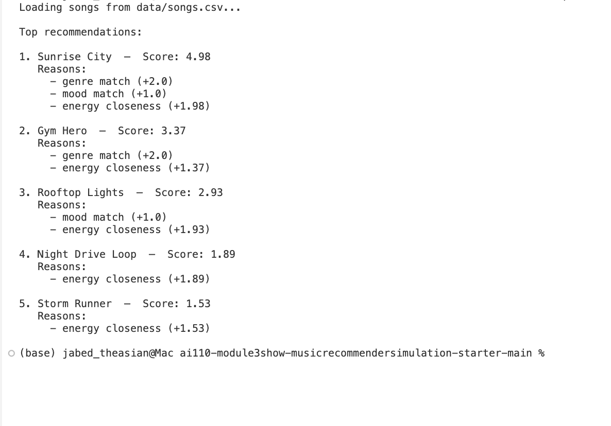

# 🎵 Music Recommender Simulation

## Project Summary

In this project you will build and explain a small music recommender system.

Your goal is to:

- Represent songs and a user "taste profile" as data
- Design a scoring rule that turns that data into recommendations
- Evaluate what your system gets right and wrong
- Reflect on how this mirrors real world AI recommenders

Replace this paragraph with your own summary of what your version does.

---

## How The System Works

This simulation builds a small content-based recommender that prioritizes musical "vibe" (how a song feels) while also respecting genre and explicit mood tags. Real-world recommenders typically perform two steps: (1) retrieve a compact set of candidate tracks using fast signals (popularity, co-listen, or embedding nearest-neighbors), and (2) score and re-rank those candidates with a richer model that combines content features (audio descriptors, genre), user preference history (long and short-term taste), and contextual signals (time, device). In this repository we keep a simple, transparent approach: compute a numeric similarity score between a user's profile and each song (using features like energy, valence, tempo, danceability, acousticness, and genre/mood matches), then sort by that score and apply a small post-filter (e.g., dedupe artist or prefer diversity if needed).

Features used by `Song` objects in this simulation:

- `genre` (categorical)
- `mood` (categorical tag, e.g., "chill", "happy", "intense")
- `energy` (float, 0–1)
- `valence` (float, 0–1)
- `tempo_bpm` (numeric)
- `danceability` (float, 0–1)
- `acousticness` (float, 0–1)

Features stored in each `UserProfile` for scoring:

- preferred `genre` (or multiple genres with weights)
- preferred `mood` (optional; used as a soft constraint)
- preferred numeric targets: `energy` (0–1), `valence` (0–1), `tempo_bpm` (numeric)
- history: recent liked/saved songs (used to build a short-term profile via averaging)

How scoring and ranking work in this simulation:

- Scoring rule: for each song we compute a per-feature score that rewards closeness to the user's preference (for numeric features) and exact/partial matches for categorical features. Scores are combined using tunable weights into a single scalar per song.
- Ranking rule: we sort songs by the scalar score and then apply simple list-level rules (e.g., limit repeats from the same artist, optionally boost novelty). The ranking step can also enforce business/UX constraints that don't make sense at the single-song level.

This design keeps the code small, testable, and interpretable while demonstrating core recommender concepts: feature extraction, a clear scoring formula, and the separation between per-item scoring and list-level ranking.

---

## Algorithm Recipe (finalized)

Scoring overview (per song):

- Genre match: +2.0 points for exact genre match.
- Mood match: +1.0 point for exact mood match (soft constraint).
- Numeric similarity: compute per-feature similarity scores (energy, valence, tempo, danceability, acousticness) using a Gaussian kernel; combine them into a normalized numeric_score in [0,1]. Then scale numeric_score by 2.0 so numeric similarity contributes up to +2.0 points.
- Total per-song score:

```
total_score = genre_pts + mood_pts + 2.0 * numeric_score
```

Where numeric_score is a weighted average of per-feature Gaussian scores:

```
score_f = exp(- (f_i - f_u)**2 / (2 * sigma_f**2))  # per-feature
numeric_score = (w_energy*score_energy + w_valence*score_valence + w_tempo*score_tempo + w_dance*score_danceability + w_acoustic*score_acousticness) / (w_energy + w_valence + w_tempo + w_dance + w_acoustic)
```

Suggested numeric weights and sigma defaults (good starting point):

- w_energy = 0.6, sigma_energy = 0.15
- w_valence = 0.5, sigma_valence = 0.15
- w_tempo = 0.4, sigma_tempo = 0.12 (tempo normalized to 0–1 before comparing)
- w_dance = 0.3, sigma_dance = 0.15
- w_acoustic = 0.2, sigma_acoustic = 0.15

Notes:

- This recipe uses genre and mood as strong, interpretable anchors and lets continuous audio descriptors (energy, valence, tempo, danceability, acousticness) shape fine-grained similarity.
- If you want more serendipity, reduce genre_pts and increase the numeric scaling.

## Example user taste profile (dictionary)

```
user_profile = {
   "favorite_genre": "lofi",
   "favorite_mood": "chill",
   "target_energy": 0.35,
   "target_valence": 0.60,
   "target_tempo_bpm": 78,
   "target_danceability": 0.60,
   "target_acousticness": 0.75,
   "recent_history": [2, 4, 9]  # song ids (optional)
}
```

Critique prompt (ask Copilot/assistant):

"Given the `user_profile` above, critique whether these target preferences are expressive enough to distinguish 'intense rock' from 'chill lofi'. Suggest adjustments or additional fields (e.g., allow multiple favorite_genres with weights, or add a 'strictness' parameter that controls how tightly numeric features must match)."

## Prompt to expand `data/songs.csv` (paste into Copilot Chat)

Use this prompt to ask the assistant to generate 5–10 more song rows in CSV format using the existing headers. It asks for diverse genres and moods and valid numeric values:

"Please generate 5–10 additional songs in CSV format that use the exact headers `id,title,artist,genre,mood,energy,tempo_bpm,valence,danceability,acousticness`. Start ids at 11. Include a diverse set of genres (classical, metal, reggae, country, edm, blues, folk, punk, etc.) and moods (calm, aggressive, laidback, nostalgic, party, soulful, intimate, angry). Make numeric fields realistic: energy/valence/danceability/acousticness between 0.0 and 1.0 with two decimal places, tempo_bpm as an integer."

Example additional rows (you can paste these directly into `data/songs.csv`):

```
11,Morning Sonata,Silver Strings,classical,calm,0.22,60,0.30,0.12,0.95
12,Thunder Forge,Iron Veil,metal,aggressive,0.95,170,0.25,0.45,0.05
13,Island Breeze,Rasta Roots,reggae,laidback,0.55,78,0.70,0.67,0.40
14,Country Road,Amber Fields,country,nostalgic,0.48,98,0.60,0.50,0.65
15,Neon Rave,Electric Pulse,edm,party,0.88,128,0.85,0.92,0.08
16,Blue Midnight,Delta Soul,blues,soulful,0.46,88,0.34,0.41,0.72
17,Campfire Tale,Meadow Lark,folk,intimate,0.33,70,0.62,0.36,0.88
18,City Riot,Fast Riot,punk,angry,0.90,160,0.20,0.77,0.12
```

## Visualization: data flow (Mermaid.js)

```mermaid
flowchart LR
   A[User Preferences] --> B[Load songs.csv]
   B --> C{For each song}
   C --> D[Compute per-feature scores]
   D --> E[Combine into total_score]
   E --> F[Collect scored songs]
   F --> G[Sort by total_score desc]
   G --> H[Apply list-level rules (dedupe, diversity)]
   H --> I[Top-K Recommendations]
```

## Potential biases and limitations

- This system may over-prioritize genre if genre points are high; excellent cross-genre matches might be missed.
- Small catalog and hand-chosen features limit generalization; production systems use large behavior logs and learned embeddings.
- Mood tags are subjective and may be inconsistent; numeric audio features help but can be noisy.

## Sample terminal output 



## Getting Started

### Setup

1. Create a virtual environment (optional but recommended):

   ```bash
   python -m venv .venv
   source .venv/bin/activate      # Mac or Linux
   .venv\Scripts\activate         # Windows

   ```

2. Install dependencies

```bash
pip install -r requirements.txt
```

3. Run the app:

```bash
python -m src.main
```

### Running Tests

Run the starter tests with:

```bash
pytest
```

You can add more tests in `tests/test_recommender.py`.

---

## Experiments You Tried

Use this section to document the experiments you ran. For example:

- What happened when you changed the weight on genre from 2.0 to 0.5
- What happened when you added tempo or valence to the score
- How did your system behave for different types of users

---

## Limitations and Risks

Summarize some limitations of your recommender.

Examples:

- It only works on a tiny catalog
- It does not understand lyrics or language
- It might over favor one genre or mood

You will go deeper on this in your model card.

---

## Reflection

Read and complete `model_card.md`:

[**Model Card**](model_card.md)

Write 1 to 2 paragraphs here about what you learned:

- about how recommenders turn data into predictions
- about where bias or unfairness could show up in systems like this

---

## 7. `model_card_template.md`

Combines reflection and model card framing from the Module 3 guidance. :contentReference[oaicite:2]{index=2}

```markdown
# 🎧 Model Card - Music Recommender Simulation

## 1. Model Name

Give your recommender a name, for example:

> VibeFinder 1.0

---

## 2. Intended Use

- What is this system trying to do
- Who is it for

Example:

> This model suggests 3 to 5 songs from a small catalog based on a user's preferred genre, mood, and energy level. It is for classroom exploration only, not for real users.

---

## 3. How It Works (Short Explanation)

Describe your scoring logic in plain language.

- What features of each song does it consider
- What information about the user does it use
- How does it turn those into a number

Try to avoid code in this section, treat it like an explanation to a non programmer.

---

## 4. Data

Describe your dataset.

- How many songs are in `data/songs.csv`
- Did you add or remove any songs
- What kinds of genres or moods are represented
- Whose taste does this data mostly reflect

---

## 5. Strengths

Where does your recommender work well

You can think about:

- Situations where the top results "felt right"
- Particular user profiles it served well
- Simplicity or transparency benefits

---

## 6. Limitations and Bias

Where does your recommender struggle

Some prompts:

- Does it ignore some genres or moods
- Does it treat all users as if they have the same taste shape
- Is it biased toward high energy or one genre by default
- How could this be unfair if used in a real product

---

## 7. Evaluation

How did you check your system

Examples:

- You tried multiple user profiles and wrote down whether the results matched your expectations
- You compared your simulation to what a real app like Spotify or YouTube tends to recommend
- You wrote tests for your scoring logic

You do not need a numeric metric, but if you used one, explain what it measures.

---

## 8. Future Work

If you had more time, how would you improve this recommender

Examples:

- Add support for multiple users and "group vibe" recommendations
- Balance diversity of songs instead of always picking the closest match
- Use more features, like tempo ranges or lyric themes

---

## 9. Personal Reflection

A few sentences about what you learned:

- What surprised you about how your system behaved
- How did building this change how you think about real music recommenders
- Where do you think human judgment still matters, even if the model seems "smart"
```
